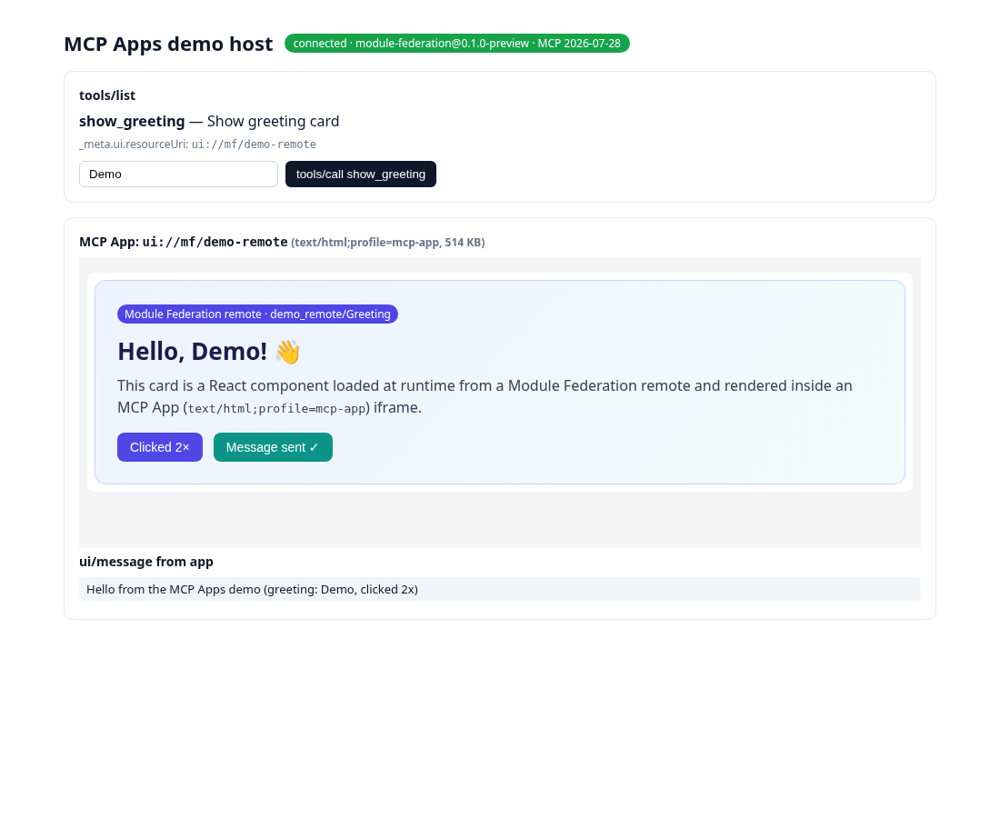

# MCP Apps demo

A small, self-contained end-to-end demo of the unofficial MCP Apps 2.x preview of `@module-federation/mcp-apps` on the MCP Apps 2.x / MCP Core 2.x stack.



| Piece | File | What it does |
|---|---|---|
| MCP server | `server.mjs` | `createServer()` + `createStreamableHttpHandler` / `serveStdioServer` (package public API, on the SDK's `createMcpHandler` / `serveStdio`) → Streamable HTTP at `/mcp`, or stdio with `--stdio`. Both speak MCP **2026-07-28** (`server/discover`) and **2025-11-25** (`initialize`). |
| Config | `mcp_apps.json` | One remote (`demo_remote`) and one tool (`show_greeting`) → `ui://mf/demo-remote` (`text/html;profile=mcp-app`). |
| MF remote | `remote/src/Greeting.jsx` | Real Module Federation remote built with Rsbuild (`remoteEntry.js`, shares React as a singleton). |
| Host | `host/src/index.jsx` | `@modelcontextprotocol/client` 2.x connects to `/mcp`, runs `tools/list` → `tools/call` → `resources/read`, and renders the result with the package's `McpAppRenderer` (AppBridge 2.x). Shows `ui/message` requests sent back by the app. |
| Screenshot | `screenshot.mjs` | Headless Chrome via CDP (no Playwright). Waits for the remote to render, clicks it, checks the `ui/message` reaches the host, and saves `screenshot.png`. |

## Run

```bash
git clone -b codex/mcp-apps-spec-upgrade https://github.com/tonoizer/mcp-apps-spec2-preview.git
cd mcp-apps-spec2-preview
npm ci
npm run demo                # builds remote + host, then serves http://localhost:4173/
# open http://localhost:4173/
```

Other modes:

```bash
npm run demo:stdio          # MCP over stdio (MF remote still served on :4173 for the iframe)
npm run demo:screenshot     # with `npm run demo` running: headless check + examples/demo/screenshot.png (Chrome; Node >= 22, or Node 20.10+ — re-runs itself with --experimental-websocket)
DEMO_PORT=5000 npm run demo # use another port (config is rewritten on the fly)
```

Inspect it with the official MCP Inspector in either protocol era:

```bash
npx -y @modelcontextprotocol/inspector@2.10.1 --cli http://localhost:4173/mcp --transport http --protocol-era modern --method tools/list
npx -y @modelcontextprotocol/inspector@2.10.1 --web http://localhost:4173/mcp   # UI: Apps tab renders the MCP App
```

Uses no dependencies beyond what the package already has: Rsbuild, React, express and the MCP SDKs are already in `package.json`. `verify/07-demo.mjs` runs the demo in CI style over HTTP and stdio, plus a headless render when Chrome is available.
